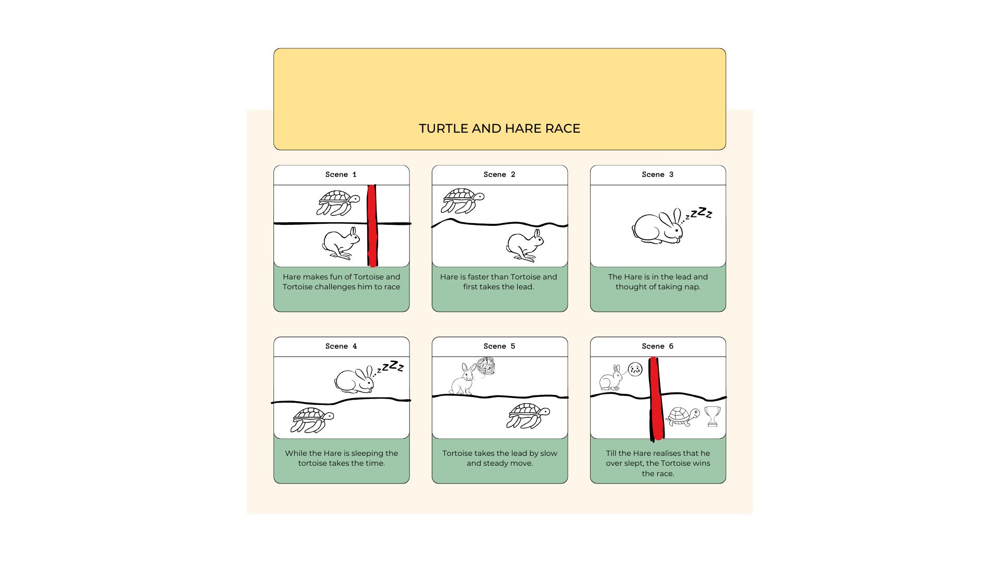

# 0x08 : 2D Animations (Project) #

## Assignment ##

### Step 1: Storyboard ###

github URL: https://github.com/Devgarg1302/0x08-2d-animation-project.git

### Step 2: Animation ###

### Step 2: Animation ###

Using the [`requestAnimationFrame`
interface](https://developer.mozilla.org/en-US/docs/Web/API/window/requestAnimationFrame) 

Create an animation of a composition of 2d geometry,
its tranforms and /or its fill/stroke styles.

As a project this gets submitted on the second
deadline.

## Submit ##

### Storyboard ###

1. Git URL
2. Commit ID
3. Storyboard (One image containing the storyboard)

### Final Project ###

1. Git URL
2. Commit ID
3. Storyboard (One image containing the storyboard)
3. Teaser
4. Video Link
